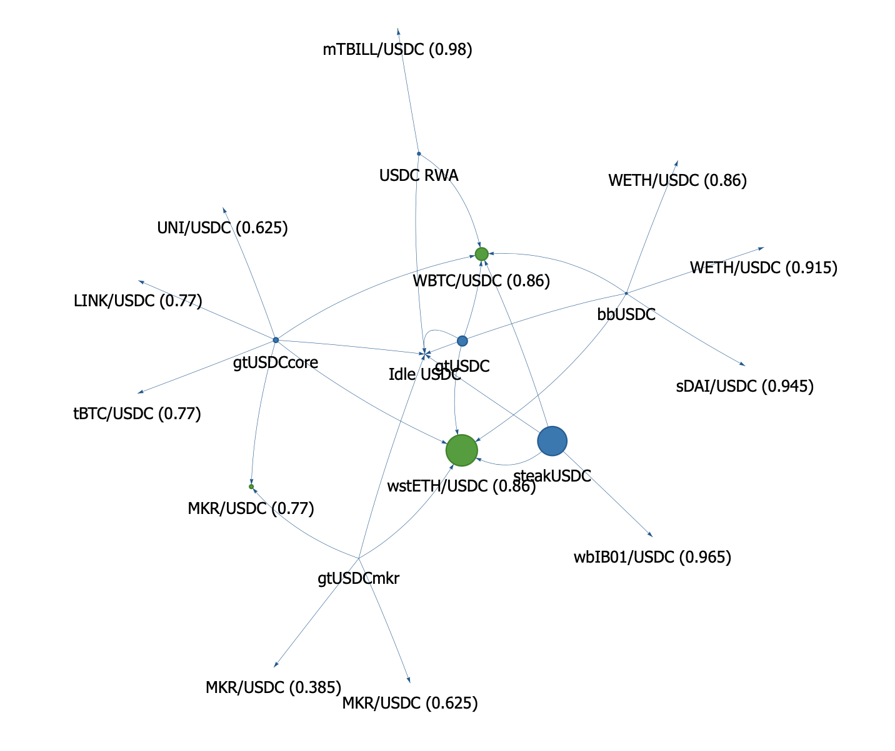

# Bluenet

Network (or graph) visualization of Morpho Blue markets and Vaults.

Example for USDC:

Markets are green nodes, vaults are blue nodes, and arrow represent vault allocations into markets. Nodes' size is proportionnal to the total supply of the market/vault.

Powered by the [Morpho Blue API](https://blue-api.morpho.org/graphql).
